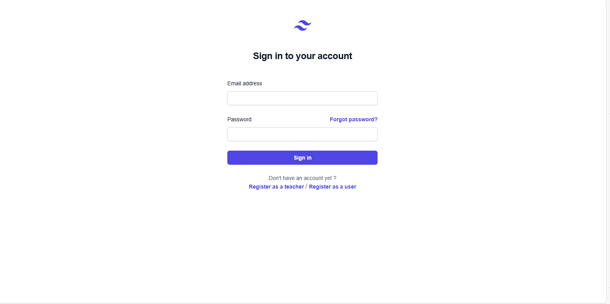
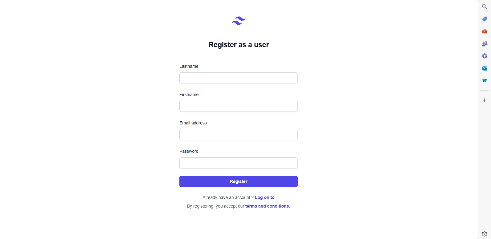
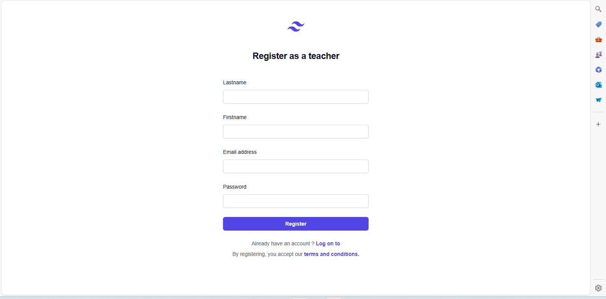
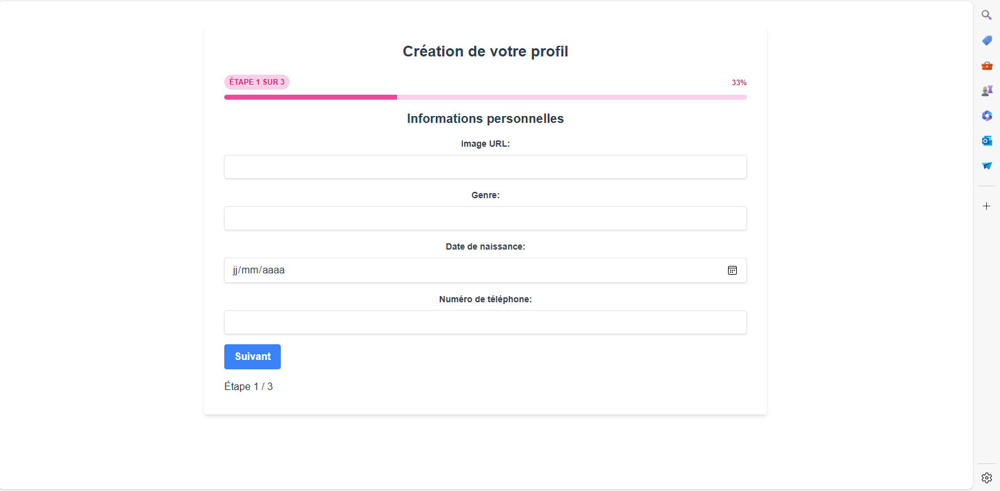
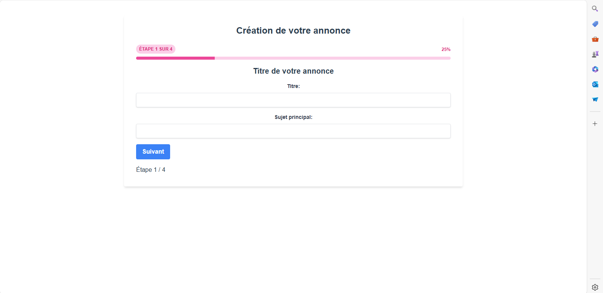
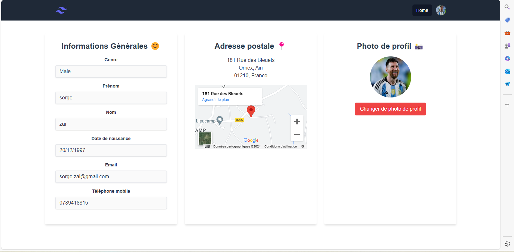
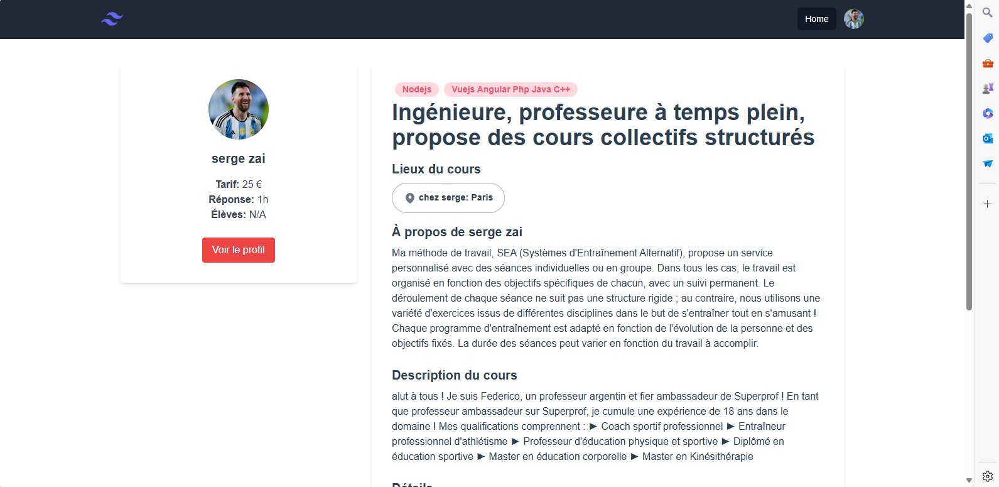
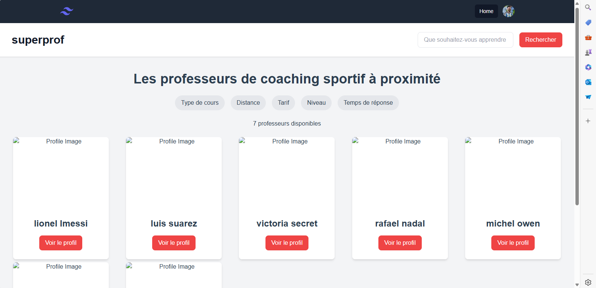

# ONLINE COURSES WEB APP    


## Description

School project aimed at developing a full-stack application for managing online courses. The application allows users to book course sessions with registered instructors based on a specific theme. Instructors can sign up, register their account, and post announcements about their courses.

## Technologies Used

- **Frontend:** Vue.js
- **Backend:** Node.js, Express
- **Database:** MongoDB

## Features

- User registration and login
- Instructors can sign up and create an account
- Instructors can post announcements for their courses
- Users can browse and book course sessions based on themes
- Interaction with a REST API for various functionalities

## Setup and Installation

1. Clone the repository
2. Install dependencies for both frontend and backend
3. Configure environment variables
4. Run the development server

## Commands : 
```
npm install
```
```
npm run serve
```
```
npm run build
```
```
npm run lint
```
## Screens

#### Login Screen

#### User Register Screen

#### Teacher Register Screen

#### Create Profil Screen

#### Create Annonce Screen

#### Profile Screen

#### Annonce Screen

#### Home Screen
